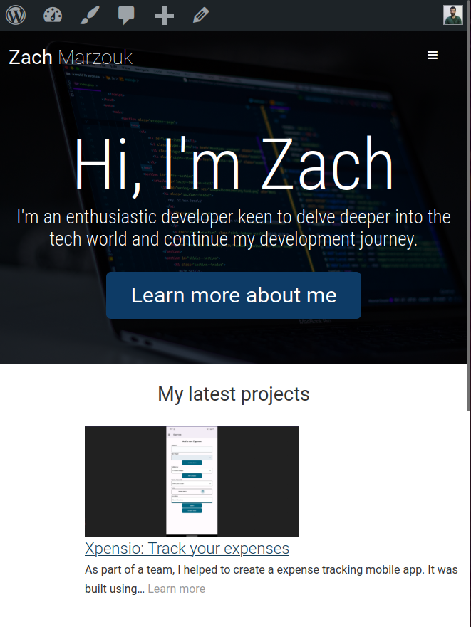

# WordPress portfolio

I created a new mock portfolio using Wordpress, PHP, and Sass. This is based on a PHP course I completed. Please note, this site is not currently hosted online.

# How to use

To view the project, follow these steps:

Clone the repository onto your local system:

`git clone <repository-url>`

1. Set up a local development environment:
   Ensure you have Local by Flywheel installed on your system.
   Create a new project in Local by Flywheel, configuring it to use the appropriate settings for your development environment.

2. Configure the project:
   Import the cloned WordPress files into your Local by Flywheel project.
   Set up the necessary database and environment configurations.

3. Run the project:
   Start your Local by Flywheel project, which will launch the WordPress site on your local environment.

4. View the website:
   Open your web browser and visit the URL provided by Local by Flywheel to access the WordPress portfolio site.

Feel free to modify or customize the project as needed for your own use.
